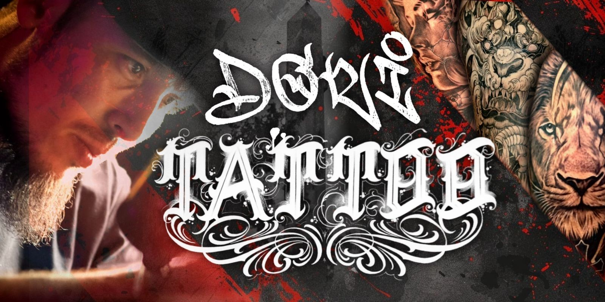
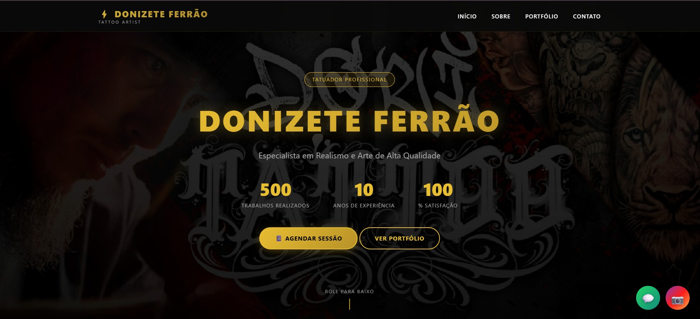
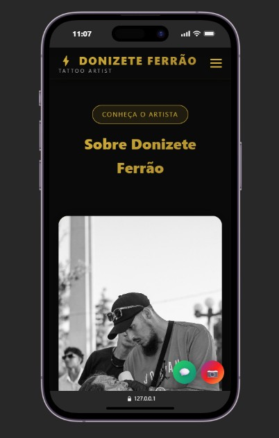

# 🎨 Donizete Ferrão Tattoo - Landing Page Profissional

  
  
  
  
  
  
  

---

## 📋 Sobre o Projeto

Landing page profissional desenvolvida para **Donizete Ferrão**, tatuador especializado em realismo e arte de alta qualidade. O site apresenta portfólio completo, sistema de filtros dinâmicos, formulário de contato integrado ao WhatsApp e design totalmente responsivo.

🔗 **[Ver Demo ao Vivo](https://donizette-ferrao.netlify.app/)**

---

## 🎯 Funcionalidades

- ✅ **Design Responsivo** - Adaptável para desktop, tablet e mobile
- ✅ **Portfólio Dinâmico** - Sistema de filtros por categoria com animações
- ✅ **Integração WhatsApp** - Formulário de contato direto via API WhatsApp
- ✅ **Animações Suaves** - Scroll reveal e transições CSS otimizadas
- ✅ **Performance Otimizada** - Lazy loading de imagens e código minificado
- ✅ **SEO Friendly** - Meta tags e estrutura semântica HTML5
- ✅ **Menu Mobile** - Navegação hamburger com overlay e animações
- ✅ **Botões Flutuantes** - Acesso rápido ao WhatsApp e Instagram
- ✅ **Google Maps** - Integração para localização do estúdio

---

## 🖼️ Screenshots

### 💻 Desktop

### 📱 Mobile

---

## 🚀 Tecnologias Utilizadas

### **Frontend**
- **HTML5** - Estrutura semântica e acessível
- **CSS3** - Estilização moderna com Flexbox e Grid
- **JavaScript ES6+** - Lógica de interação e manipulação DOM

### **Recursos e Técnicas**
- **CSS Variables** - Sistema de design tokens para cores e espaçamentos
- **Intersection Observer API** - Animações de scroll reveal performáticas
- **CSS Grid & Flexbox** - Layout responsivo e adaptável
- **Media Queries** - Breakpoints otimizados para diferentes dispositivos
- **LocalStorage** - (Preparado para implementação futura)
- **Fetch API** - (Preparado para integração com backend)

### **Otimizações**
- Lazy loading de imagens
- Animações CSS com `will-change` e `transform`
- Debouncing em eventos de scroll e resize
- Código modular e reutilizável
- Compressão e otimização de assets

---
